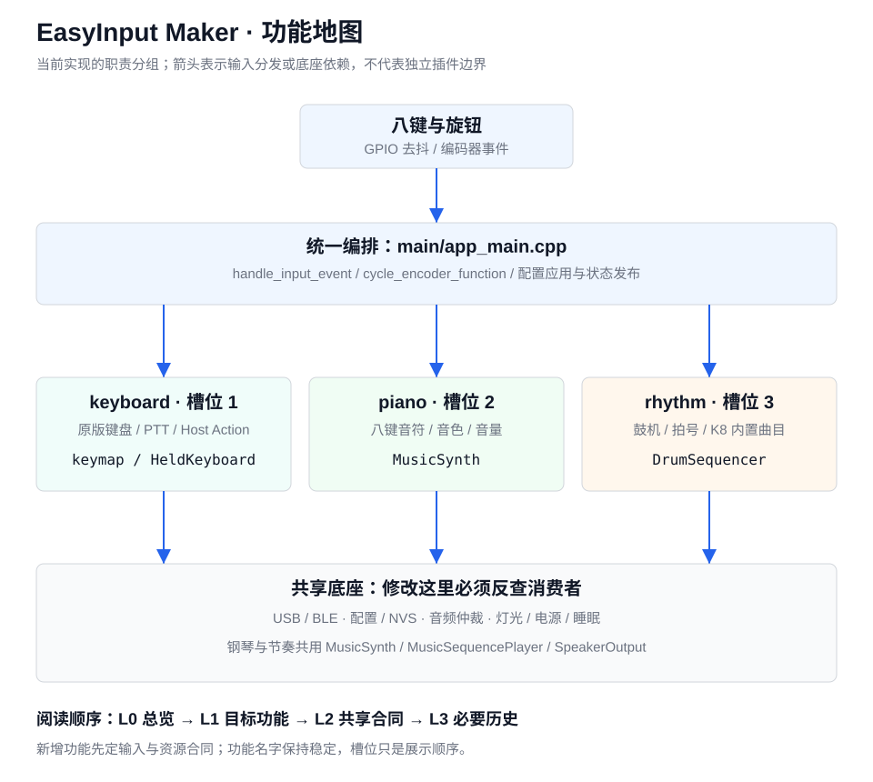

# 从三个功能到可维护的功能集合

这里是人工和 AI 共用的阅读入口。描述以当前实践分支源码为准；其他分支先核对能力，不能把课程起点缺少 Host Action 当成故障。

构建边界：槽位 2/3 仅在 `EASY_INPUT_SPEAKER_DIAGNOSTIC` 或 `EASY_INPUT_SPEAKER_ASSETS_PRODUCT` 启用时存在；不带扬声器的构建只有一个槽位。开始前核对根 CMake 配置和实际构建宏，不按本文标题假定所有变体有三功能。

## 先读哪一层

| 层级 | 内容 | 什么时候读 |
| --- | --- | --- |
| L0 总览 | 本页、根目录 [DEV_STATE](../../DEV_STATE.md) 顶部、当前分支 | 每次开始，明确目标和已验证状态 |
| L1 功能 | [keyboard](features/keyboard.md)、[piano](features/piano.md)、[rhythm](features/rhythm.md) | 只读本次涉及的功能；“功能一”对应 keyboard |
| L2 共享合同 | [共享底座](shared.md) | 改公共文件、协议、输入路由、配置、音频或电源时必读 |
| L3 历史 | [审计报告](../review/input-music-audit-2026-09-06.md)、flow 任务/进展 | 查某个已知问题或决策；不要每次从头读所有历史 |

共享层变更必须反查全部消费者。只读一张功能卡，不意味着只能看这个功能的代码。

## 当前结构图



图中是职责分组，不是三个已经独立的库。三个功能目前共用 `main/app_main.cpp`；钢琴和节奏还共用合成器、曲目播放器和唯一扬声器 worker。

## 不用 AI：20 分钟阅读顺序

1. 在 Git 中确认分支，用 `git status --short` 查看尚未提交的改动。
2. 读目标功能卡的“能做什么”和“不能改变什么”，先知道用户操作预期。
3. 打开 `main/app_main.cpp`，搜索 `handle_input_event`，沿分发函数走一遍；使用编辑器的“查找所有引用”。
4. 打开功能卡列出的纯逻辑类和测试，先读测试断言，再读实现。
5. 只在需要发声、保存或发给电脑时进入 `main/platform/`。纯算法不能直接调用 GPIO/I2S/NVS。
6. 对照共享合同判断修改会影响谁，写下失败路径，再动代码。

文件地图：`components/keyboard/` 是可在电脑上测试的 C++ 逻辑；`main/platform/` 是 ESP-IDF 适配；`features/speaker_assets/` 是原版声音资源服务，不是“三个功能”的统一目录；`host_test/` 放回归测试。不要把未来功能直接塞进 `speaker_assets`。

## 一次修改的完整步骤

1. 用一句话描述预期，例如“rhythm 在队列满时旋转旋钮，也不能滚动电脑页面”。
2. 写出功能 ID、允许修改的文件、共享消费者、保持不变的行为。复制 [变更模板](change-template.md) 即可。
3. 能在宿主复现的缺陷先补失败测试；行为不变的优化先保存代表性输出或回归基线。
4. 小步修改；业务修复和整文件格式化分开。每一步检查 `git diff`。
5. 运行目标功能测试，再运行完整宿主回归。共享文件变更不能仅测“自己的功能”。
6. 平台变更需要 ESP-IDF 5.5.5 构建；耗时全量构建优先 CI。编译成功后，烧录和实板验收仍单独确认。
7. 更新功能卡/共享合同中发生变化的事实和 DEV_STATE；报告未验证项。默认不提交、不推送、不烧录。

已配置好宿主工具链时，标准命令：

```sh
cmake -S host_test -B build-host -DCMAKE_BUILD_TYPE=Debug
cmake --build build-host --parallel 4
ctest --test-dir build-host --output-on-failure
git diff --check
```

命令找不到时参考 [环境准备](../getting-started/README.md)，不要把个人工具绝对路径写进项目。本文是工作流，不代表每次都已运行完整固件构建。

## AI 如何读取和修改

AI 先读根 AGENTS/AI_DEVELOPMENT、DEV_STATE 顶部和本页，再按功能卡选择源码。存在 `.codegraph/` 时先检查索引，并以 CodeGraph 查符号与调用者；不可用时说明原因并回到真实源码。私人 Obsidian 是可选的本机背景源，公开仓库不依赖私人路径。

可直接给任何 AI 的任务描述：

```text
任务所属功能：piano（示例）。
先读 docs/development/README.md、features/piano.md 和 shared.md。
核对当前分支及未提交修改，定位实际调用者和测试。
先列修改文件、共享消费者、保留行为和验证方案，再实施小步修改。
声音资源、录音优先级、GPIO8、外部协议不得因本功能修改而被改坏。
运行定向与完整宿主测试；没有实板证据就标注待验证。
更新 DEV_STATE 与相关功能卡；不自动提交、推送或烧录。
```

模板中的 `features/piano.md` 相对本目录；实际完整路径为 `docs/development/features/piano.md`。

## 扩展到 4、10、30 个功能

使用稳定的名字标识功能，例如 `keyboard`、`piano`、`rhythm`、未来的 `timer`；“第几个槽位”只是显示顺序，不是持久身份。这里的名字目前是文档 ID，尚未变成固件 registry 或 wire 字段。

| 阶段 | 应做的事 | 本次状态 |
| --- | --- | --- |
| 当前 3 个 | 功能卡、共享消费者矩阵、修改模板、回归边界 | 已建立；实际代码仍有耦合 |
| 加第 4 个之前 | 先设计唯一功能状态/注册表，逐步替代槽位数字和两个布尔标志；把每个功能的输入处理从 app_main 抽到单独适配模块 | 设计建议，未实施 |
| 功能继续增长 | 每个功能声明进入/退出、输入所有权、资源需求、配置和测试；由调度器统一仲裁 | 目标合同，未实施插件框架 |
| 接近 10—30 个 | 另做可查找的功能选择交互和资源预算；不能要求用户连续长按 29 次，也不能让 30 个功能同时占用音频/无线资源 | 产品与容量设计，未实施 |

新增功能必须填写 [模板](change-template.md)，并满足：进入失败可保留旧功能；退出后松开旧 HID/音符；已消费但执行失败的输入不能落到别的功能；共享资源只有一个硬件 owner；旧配置有明确兼容策略；有跨槽位组合测试。

建议的未来接口可区分 `NotHandled`、`Handled`、`HandledFailed`，避免用一个 bool 同时表达“是否拥有输入”和“是否执行成功”。这是需要单独迁移与测试的设计方向，不是当前已有 API。

## 格式与代码规范

- C/C++ 用根目录 [.clang-format](../../.clang-format)，两空格缩进，按当前代码使用的 Google 风格约定；列宽以 100 为格式化目标。不改语义、不排序 include，减少不必要变更。
- 已安装 clang-format 时，先 `clang-format --version`。本配置已用 19.1.2 解析验证；协作建议使用 19.x，不宣称不同版本输出逐字一致。没有工具时先按本页规范手工编辑，不影响阅读与测试。
- 只对明确选择的第一方文件执行下面命令，不递归格式化第三方、生成文件或整个仓库。旧文件可先用编辑器“格式化选中代码”缩小范围。

```sh
clang-format --style=file --dry-run --Werror components/keyboard/src/music_live_control.cpp
# 只有审阅差异后才选择写入；此命令可能调整整个指定文件。
clang-format --style=file -i components/keyboard/src/music_live_control.cpp
git diff -- components/keyboard/src/music_live_control.cpp
git diff --check
```

格式化只解决外观。生命周期、并发、持久化失败和外部契约要写简短中文原因型注释，并靠测试验证。新纯逻辑使用定长状态和可测接口；禁止在音频逐样本路径加入堆分配、日志或网络调用。

本指南不会阻止所有误改；它把依赖、职责、检查步骤显式化。真正的隔离仍需要未来逐步拆分代码和持续回归。
